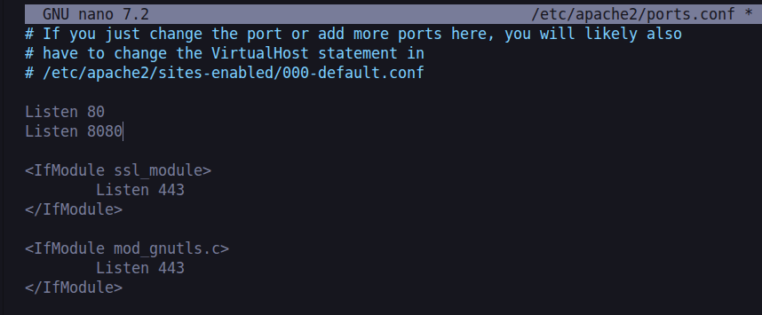
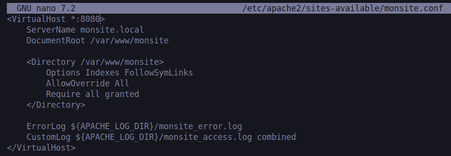
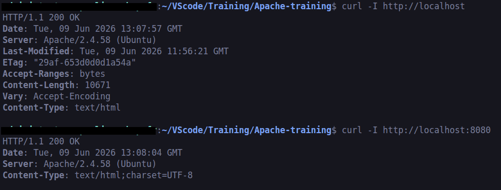

# Configurer un serveur de base avec Apache

## Les fichiers de configuration clés

| Fichier | Rôle |
| --- | --- |
| `/etc/apache2/apache2.conf` | Configuration principale |
| `/etc/apache2/ports.conf` | Ports d'écoute |
| `/etc/apache2/sites-available/` | VirtualHosts disponibles |
| `/etc/apache2/sites-enabled/` | VirtualHosts actifs (liens symboliques) |
| `/etc/apache2/mods-available/` | Modules disponibles |
| `/etc/apache2/mods-enabled/` | Modules activés |

---

## Créer un VirtualHost

Un VirtualHost permet de servir un site avec son propre domaine, dossier et configuration.

### 1. Créer le dossier racine du site

```bash
sudo mkdir -p /var/www/monsite
sudo chown -R $USER:$USER /var/www/monsite
```

> `chown` = change le propriétaire du dossier pour ton utilisateur courant

### 2. Créer le fichier de configuration

```bash
sudo nano /etc/apache2/sites-available/monsite.conf
```

Contenu minimal :

```apache
<VirtualHost *:80>
    ServerName monsite.local
    DocumentRoot /var/www/monsite

    <Directory /var/www/monsite>
        Options Indexes FollowSymLinks
        AllowOverride All
        Require all granted
    </Directory>

    ErrorLog ${APACHE_LOG_DIR}/monsite_error.log
    CustomLog ${APACHE_LOG_DIR}/monsite_access.log combined
</VirtualHost>
```

> `ServerName` = domaine ou IP du serveur
> `DocumentRoot` = dossier racine des fichiers servis
> `AllowOverride All` = autorise les fichiers `.htaccess`
> `ErrorLog` / `CustomLog` = chemins des fichiers de log

### 3. Activer le site

```bash
sudo a2ensite monsite.conf
```

> `a2ensite` = crée un lien symbolique dans `sites-enabled/`

### 4. Désactiver le site par défaut (optionnel)

```bash
sudo a2dissite 000-default.conf
```

### 5. Recharger Apache pour activer le site

Après `a2ensite`, Apache te demande de recharger :

```bash
sudo systemctl reload apache2
```

### 6. Tester la configuration

```bash
sudo apache2ctl configtest
```

Tu dois voir `Syntax OK` avant de redémarrer.

#### Avertissement AH00558 (sans danger)

Si tu vois ce message :

```text
AH00558: apache2: Could not reliably determine the server's fully qualified domain name
```

Apache ne trouve pas de `ServerName` global. Pour le supprimer :

```bash
echo "ServerName localhost" | sudo tee -a /etc/apache2/apache2.conf
```

### 7. Redémarrer Apache

```bash
sudo systemctl restart apache2
```

---

## Activer des modules

Apache est modulaire. Certaines fonctionnalités nécessitent d'activer un module.

```bash
sudo a2enmod rewrite      # mod_rewrite (URLs propres, .htaccess)
sudo a2enmod ssl          # HTTPS
sudo a2enmod headers      # Manipulation des en-têtes HTTP
sudo systemctl restart apache2
```

> `a2enmod` = active un module
> `a2dismod` = désactive un module

Après chaque activation, Apache demande de redémarrer pour appliquer :

```bash
sudo systemctl restart apache2
```

### mod_rewrite

Permet de réécrire les URLs (ex. `/produit/42` au lieu de `/index.php?id=42`). Utilisé par la plupart des CMS (WordPress, Laravel…).

```bash
sudo a2enmod rewrite
sudo systemctl restart apache2
```

### mod_ssl

Active le support HTTPS. Apache active automatiquement ses dépendances (`socache_shmcb`, `mime`) si elles ne le sont pas déjà.

```bash
sudo a2enmod ssl
sudo systemctl restart apache2
```

> Une fois le module activé, il faut encore configurer un certificat SSL pour utiliser le HTTPS. Voir `/usr/share/doc/apache2/README.Debian.gz` pour créer un certificat auto-signé.

---

## Configurer les ports d'écoute

Les ports sont configurés dans **deux endroits** qui doivent être cohérents.

### 1. `/etc/apache2/ports.conf` — déclarer les ports d'écoute

Ce fichier dit à Apache sur quels ports il doit écouter :

```apache
Listen 80
Listen 8080
```

Tu l'édites avec :

```bash
sudo nano /etc/apache2/ports.conf
```



### 2. Le VirtualHost — associer un port à un site

Dans `/etc/apache2/sites-available/monsite.conf`, la première ligne dit sur quel port ce site répond :

```apache
<VirtualHost *:8080>
```

> `*` = toutes les interfaces réseau, `8080` = le port

### En pratique, pour ajouter un port

```bash
# 1. Ajouter le port dans ports.conf
sudo nano /etc/apache2/ports.conf
# → ajouter : Listen 8080

# 2. Mettre à jour le VirtualHost
sudo nano /etc/apache2/sites-available/monsite.conf
# → changer <VirtualHost *:80> en <VirtualHost *:8080>

# 3. Tester et redémarrer
sudo apache2ctl configtest
sudo systemctl restart apache2
```

> Si tu déclares `Listen 8080` mais que ton VirtualHost reste sur `*:80`, le port 8080 sera ouvert mais aucun site n'y répondra.



---

## Vérifier que tout fonctionne

### Dans le navigateur

Ouvre les deux URLs et vérifie qu'elles affichent la même page :

```text
http://localhost
http://localhost:8080
```

### Dans le terminal

```bash
curl -I http://localhost
curl -I http://localhost:8080
```

Les deux doivent retourner `HTTP/1.1 200 OK` dans la première ligne de la réponse.



---

## Modifier la page web selon le port

### Même contenu sur les deux ports

Si les deux VirtualHosts pointent vers le même `DocumentRoot`, toute modification du fichier sera visible sur les deux ports en même temps. C'est le comportement par défaut.

### Contenu différent par port

Si tu veux que chaque port serve une page différente, change le `DocumentRoot` dans le bloc `<VirtualHost *:8080>` :

```apache
<VirtualHost *:8080>
    ServerName monsite.local
    DocumentRoot /var/www/monsite-8080

    <Directory /var/www/monsite-8080>
        Options Indexes FollowSymLinks
        AllowOverride All
        Require all granted
    </Directory>
</VirtualHost>
```

Puis crée le dossier :

```bash
sudo mkdir -p /var/www/monsite-8080
sudo chown -R $USER:$USER /var/www/monsite-8080
```

---

## Garder un seul port actif

Un fichier `.conf` par site, pas par port — c'est la convention Apache. Si tu veux que ton site ne réponde que sur le port 8080 :

### 1. Supprimer le bloc port 80 de monsite.conf

Édite `monsite.conf` et supprime le bloc `<VirtualHost *:80>`, garde uniquement `<VirtualHost *:8080>`.

### 2. Désactiver le site par défaut

```bash
sudo a2dissite 000-default.conf
```

Sans ça, la page par défaut d'Apache continuerait à répondre sur le port 80.

### 3. Redémarrer

```bash
sudo apache2ctl configtest
sudo systemctl restart apache2
```

Ton site sera accessible uniquement sur `http://localhost:8080`.

### Conventions : quel port choisir ?

| Port | Usage |
| --- | --- |
| 80 | HTTP standard — navigateurs l'utilisent par défaut |
| 443 | HTTPS standard |
| 8080 | Développement et tests — port alternatif courant |

En **production**, on reste sur le port 80 ou 443 — les utilisateurs n'ont pas à taper le port dans l'URL. En **développement**, le port 8080 est tout à fait valide.

---

## Récap des commandes de configuration

| Action | Commande |
| --- | --- |
| Activer un site | `sudo a2ensite monsite.conf` |
| Désactiver un site | `sudo a2dissite monsite.conf` |
| Activer un module | `sudo a2enmod nom_module` |
| Désactiver un module | `sudo a2dismod nom_module` |
| Tester la config | `sudo apache2ctl configtest` |
| Recharger sans couper | `sudo systemctl reload apache2` |
| Redémarrer | `sudo systemctl restart apache2` |
