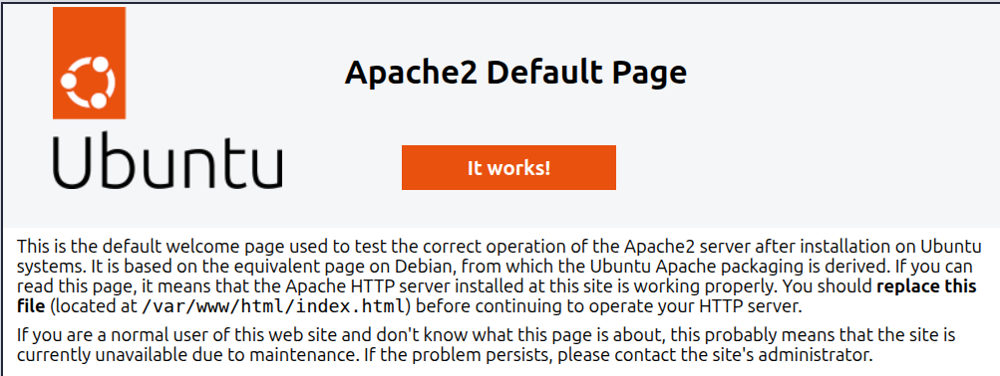

# Installation d'Apache

## 1. Mettre à jour le système avant d'installer

Avant d'installer quoi que ce soit, mets à jour la liste des paquets disponibles :

```bash
sudo apt update
```

> `sudo` = "je veux faire ça en tant qu'administrateur"
> `apt` = le gestionnaire de paquets d'Ubuntu (comme un App Store en ligne de commande)
> `update` = rafraîchit la liste des logiciels disponibles (ça n'installe rien encore)

---

## 2. Installer Apache

```bash
sudo apt install apache2 -y
```

> `install apache2` = installe le paquet Apache
> `-y` = répond "oui" automatiquement aux confirmations

L'installation prend quelques secondes. Une fois terminée, Apache est installé.

---

## 3. Vérifier qu'Apache tourne

```bash
sudo systemctl status apache2
```

Tu dois voir quelque chose comme :

```text
● apache2.service - The Apache HTTP Server
     Active: active (running) ...
```

La ligne `active (running)` en vert = Apache est lancé et fonctionne.

> `systemctl` = l'outil qui gère les services (programmes qui tournent en arrière-plan) sur Ubuntu

---

## 4. Tester dans le navigateur

Ouvre ton navigateur et va sur :

```text
http://localhost
```

Tu devrais voir la page par défaut d'Apache avec le message **"It works!"** (ou "Apache2 Ubuntu Default Page").



Si tu vois cette page, Apache fonctionne correctement.
